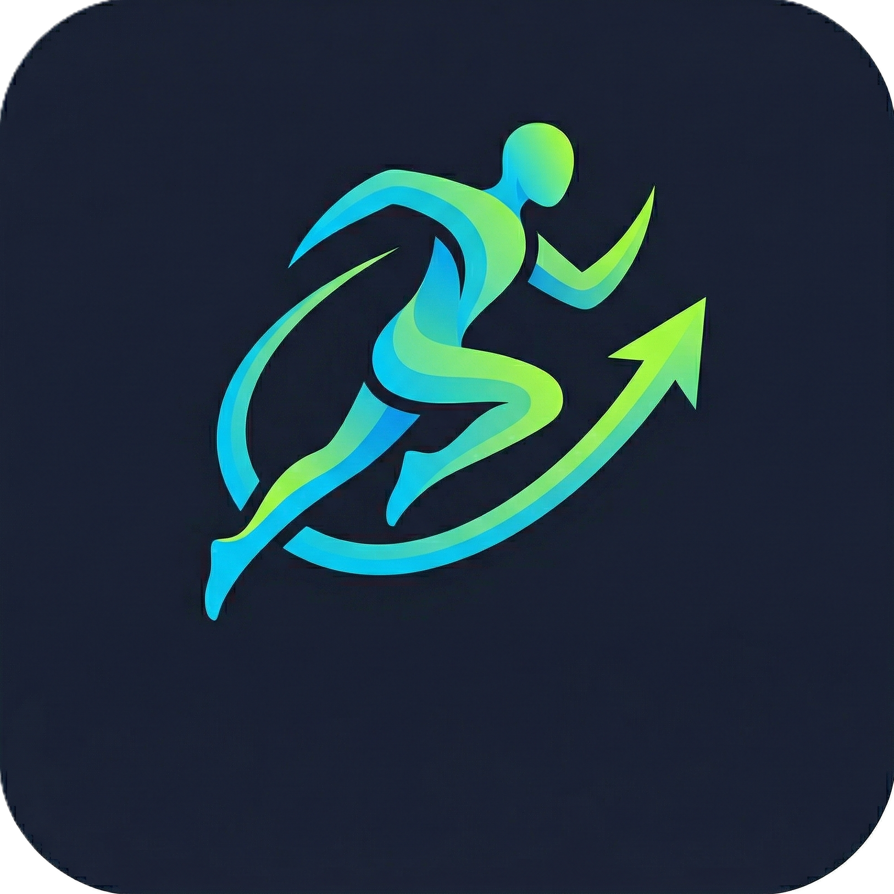
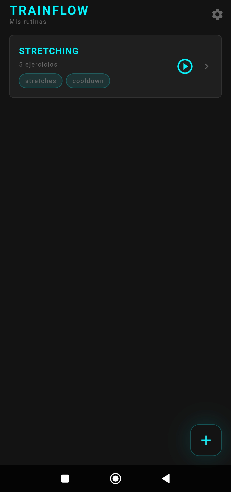
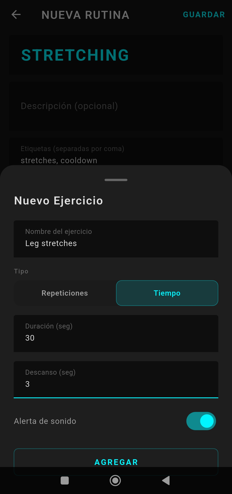
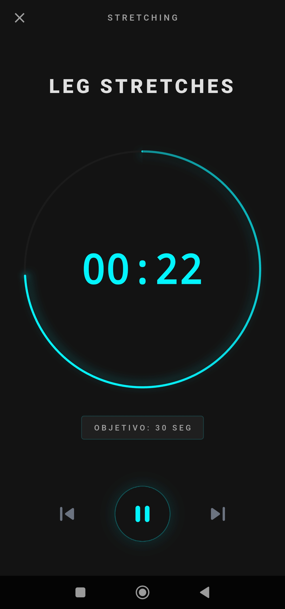

<p align="center">
  
</p>

<h1 align="center">TrainFlow</h1>

<p align="center">
  <strong>Offline-First Workout Timer &amp; Routine Manager</strong><br/>
  Built with Flutter · Powered by Isar · Zero Cloud Dependencies
</p>

<p align="center">
  
  
  
  
  
  
</p>

---

## What is TrainFlow?

**TrainFlow** is a high-performance, timer-centric mobile workout tracker designed for athletes and fitness enthusiasts who value **speed, privacy, and reliability**. Every feature runs 100% on-device — no accounts, no servers, no internet required. Your data never leaves your phone.

Create custom routines with time-based and rep-based exercises, run them through an immersive neon-styled workout player with voice cues, and back up your data as portable JSON files — all without a single network request.

---

## Visual Showcase

<p align="center">
  
  &nbsp;&nbsp;&nbsp;
  
  &nbsp;&nbsp;&nbsp;
  
</p>

---

## Features

### 🔒 Offline-First Architecture
- **Zero cloud dependencies.** All data is persisted locally using [Isar](https://isar.dev), a blazing-fast embedded NoSQL database.
- **No accounts, no sign-ups, no tracking.** 100% user privacy by design.
- **Instant startup.** No network handshakes or loading spinners — the app is usable in milliseconds.

### ⏱️ Timer-Centric Workout Engine
- **Dual exercise modes:** Time-based (countdown) and Rep-based (manual completion).
- **Automatic phase progression:** Warmup → Active → Rest → Next Exercise, all managed by a single optimized `Timer.periodic` stream to minimize CPU usage and battery drain.
- **5-second preparation countdown** before the first exercise, with TTS voice announcement of the exercise name.
- **3-second audible countdown** (beep sound effect) before each phase transition.
- **Pause, Resume, Skip Forward, Skip Back** — full playback-style controls during any workout.

### 🎙️ Audio Ducking & Voice Cues
- **Text-to-Speech (TTS)** announces exercise names, rest transitions (e.g., *"Descanso. Siguiente: Sentadillas"*), and workout completion.
- **Audio Ducking** via `audio_session`: background music (Spotify, YouTube Music, etc.) automatically lowers its volume during voice cues and sound effects — **it never pauses**.
- Custom `AudioSession` configuration with `gainTransientMayDuck` focus and `assistanceSonification` content type for smooth Android media coexistence.

### 💾 JSON Backup & Restore
- **Export** all routines to a portable `trainflow_backup.json` file via the system share sheet (send to Drive, WhatsApp, email, etc.).
- **Import** from any `.json` file. The parser robustly validates structure and safely handles missing or malformed fields.
- Isar IDs are excluded during export, so imported routines are always created as fresh objects — **no data overwrites**.

### 🎨 Premium Neon Minimal UI
- **Deep Space Gray** (`#131313`) background with **Electric Cyan** (`#00F5FF`) and **Neon Lime** (`#CCFF00`) accents.
- Centralized design-system tokens (`AppColors`, `AppTextStyles`, `AppShadows`) — no hardcoded colors anywhere.
- Custom `WorkoutTimerCircle` with gradient `SweepGradient` arc, neon glow layers via `CustomPainter`, and pulse animation during the final 5 seconds.
- Material 3 theming with `Inter` typography throughout.

### 📳 Haptic Feedback
- **Light, Medium, and Heavy** haptic patterns mapped to specific interactions (button taps, exercise drag-reorder, workout exit).
- Haptics are strictly scoped to user-initiated actions — no vibrations on timer ticks, audio events, or state changes.

### 📱 Screen Management
- **Wakelock** (`wakelock_plus`) keeps the screen on during active workouts. Automatically disabled when exiting the workout screen.

### 🏋️ Routine Management
- Create, edit, and delete routines with title, description, and comma-separated tags.
- Drag-and-drop reorderable exercise lists with swipe-to-delete confirmation.
- Real-time reactive UI powered by Isar's `.watch()` stream — changes appear instantly across all screens.
- UI labels in **Spanish** (e.g., *"Mis rutinas"*, *"Guardar"*, *"Descanso"*).

---

## Tech Stack

| Layer              | Technology                                                                 |
|--------------------|---------------------------------------------------------------------------|
| **Framework**      | [Flutter](https://flutter.dev) (Stable Channel)                           |
| **Language**       | [Dart 3.x](https://dart.dev) (Strict null-safety)                         |
| **Database**       | [Isar 3.1](https://isar.dev) (Embedded NoSQL)                             |
| **State Mgmt**     | [Riverpod 2.5](https://riverpod.dev) (Reactive providers)                |
| **Audio Engine**   | [`audio_session`](https://pub.dev/packages/audio_session) + [`flutter_tts`](https://pub.dev/packages/flutter_tts) + [`audioplayers`](https://pub.dev/packages/audioplayers) |
| **Screen Lock**    | [`wakelock_plus`](https://pub.dev/packages/wakelock_plus)                 |
| **Backup/Share**   | [`share_plus`](https://pub.dev/packages/share_plus) + [`file_picker`](https://pub.dev/packages/file_picker) |
| **Code Gen**       | [`build_runner`](https://pub.dev/packages/build_runner) + [`isar_generator`](https://pub.dev/packages/isar_generator) + [`riverpod_generator`](https://pub.dev/packages/riverpod_generator) |

---

## Architecture

TrainFlow follows a **Simplified Clean Architecture** pattern with three clearly separated layers:

```
lib/
├── core/                   # Design system & localization
│   ├── app_theme.dart          # AppColors, AppTextStyles, AppShadows, AppTheme
│   └── l10n/
│       └── app_strings.dart    # Spanish UI string constants
│
├── data/                   # Data layer (Isar models & DB service)
│   ├── isar_service.dart       # Database initialization + isarProvider
│   └── models/
│       ├── routine.dart        # @collection — Routine with toMap/fromMap
│       └── exercise.dart       # @embedded — Exercise with ExerciseType enum
│
├── providers/              # Business logic (Riverpod providers)
│   ├── routine_provider.dart   # RoutineRepository CRUD + reactive streams
│   └── workout_provider.dart   # WorkoutController timer engine + WorkoutState
│
├── services/               # Platform services
│   ├── audio_service.dart      # TTS, countdown SFX, audio ducking management
│   └── backup_service.dart     # JSON export/import via share_plus & file_picker
│
├── ui/                     # Presentation layer
│   ├── screens/
│   │   ├── home_screen.dart           # Routine list + import/export menu
│   │   ├── routine_editor_screen.dart # Routine form + reorderable exercise list
│   │   └── workout_screen.dart        # Active workout player + completion view
│   └── widgets/
│       ├── add_exercise_sheet.dart     # Bottom sheet form for new exercises
│       ├── routine_card.dart          # Swipe-to-delete routine card with play button
│       ├── workout_controls.dart      # Prev / Play-Pause / Next neon controls
│       └── workout_timer_circle.dart  # Custom arc painter with glow & pulse
│
└── main.dart               # App entry point — Isar init + ProviderScope
```

### Data Flow

```
┌──────────────┐     ┌───────────────────┐     ┌──────────────────┐
│   Isar DB    │◄───►│ RoutineRepository │◄───►│  Riverpod State  │
│  (on-device) │     │  (CRUD + watch)   │     │   (Providers)    │
└──────────────┘     └───────────────────┘     └────────┬─────────┘
                                                        │
                     ┌───────────────────┐              │
                     │ WorkoutController │◄─────────────┤
                     │  (Timer Engine)   │              │
                     └────────┬──────────┘              │
                              │                         │
                     ┌────────▼──────────┐     ┌────────▼─────────┐
                     │   AudioService    │     │    Flutter UI     │
                     │  (TTS + Ducking)  │     │   (3 Screens)    │
                     └───────────────────┘     └──────────────────┘
```

---

## Data Model

### `Routine` (Isar Collection)

| Field         | Type               | Description                                |
|---------------|--------------------|--------------------------------------------|
| `id`          | `int`              | Auto-incremented Isar primary key          |
| `title`       | `String?`          | Routine display name                       |
| `description` | `String?`          | Optional description                       |
| `tags`        | `List<String>`     | Indexed, comma-separated category tags     |
| `exercises`   | `List<Exercise>`   | Embedded exercise objects (cascade delete)  |

### `Exercise` (Isar Embedded Object)

| Field        | Type            | Description                                   |
|--------------|-----------------|-----------------------------------------------|
| `id`         | `int?`          | Optional identifier                           |
| `name`       | `String?`       | Exercise display name                         |
| `type`       | `ExerciseType`  | `time` (countdown) or `reps` (manual confirm) |
| `value`      | `int`           | Seconds (if time) or count (if reps)          |
| `restTime`   | `int`           | Rest period in seconds after this exercise    |
| `soundAlert` | `bool`          | Whether to play an audio cue at completion    |

---

## Getting Started

### Prerequisites

- [Flutter SDK](https://docs.flutter.dev/get-started/install) (Stable channel, 3.x+)
- [Dart SDK](https://dart.dev/get-dart) 3.x+
- Android Studio / Xcode (for emulator or physical device)

### Installation

```bash
# 1. Clone the repository
git clone https://github.com/JesusNF99/TrainFlow.git
cd TrainFlow

# 2. Install dependencies
flutter pub get

# 3. Generate Isar schemas and Riverpod code
dart run build_runner build --delete-conflicting-outputs

# 4. Run the app
flutter run
```

### Building for Release

```bash
# Android APK
flutter build apk --release

# Android App Bundle (for Play Store)
flutter build appbundle --release

# iOS IPA (requires Xcode and Apple Developer account)
flutter build ipa --release
```

The release APK will be located at `build/app/outputs/flutter-apk/app-release.apk`.

---

## Project Configuration

### Environment

```yaml
# pubspec.yaml
environment:
  sdk: ^3.11.3
```

### Key Dependencies

```yaml
dependencies:
  isar: ^3.1.0+1              # Offline NoSQL database
  isar_flutter_libs: ^3.1.0+1 # Platform binaries for Isar
  flutter_riverpod: ^2.5.1     # Reactive state management
  audio_session: ^0.1.21       # Audio focus & ducking
  flutter_tts: ^4.0.2          # Text-to-Speech engine
  audioplayers: ^5.2.1         # Sound effect playback
  wakelock_plus: ^1.5.1        # Screen-on during workouts
  share_plus: ^12.0.1          # Native share sheet for backups
  file_picker: ^10.3.10        # File selection for import

dev_dependencies:
  build_runner: ^2.4.0         # Code generation runner
  isar_generator: ^3.1.0+1    # Isar schema codegen
  riverpod_generator: ^2.4.0   # Riverpod codegen
  flutter_launcher_icons: ^0.13.1 # App icon generation
```

### Assets

```
assets/
├── icon.png           # App launcher icon source
└── sounds/
    └── countdown.wav  # 3-second countdown beep effect
```

---

## Usage Guide

### Creating a Routine

1. Tap the **`+`** floating action button on the Home Screen.
2. Enter a **title**, optional **description**, and **tags** (comma-separated).
3. Add exercises using the **`+ EJERCICIO`** button at the bottom.
4. For each exercise, configure:
   - **Name** — displayed and announced via TTS.
   - **Type** — `Tiempo` (countdown) or `Repeticiones` (manual).
   - **Value** — seconds or rep count.
   - **Rest time** — pause in seconds after this exercise.
   - **Sound alert** — toggle the countdown beep.
5. **Drag** exercises to reorder, **swipe left** to delete.
6. Tap **`GUARDAR`** to persist.

### Running a Workout

1. From the Home Screen, tap the **▶ play** button on any routine card, or tap **▶** in the editor.
2. The player begins with a **5-second warmup** countdown. TTS announces the first exercise.
3. The timer progresses automatically: **Active → Rest → Next Exercise**.
4. Use the **⏮ ⏸ ⏭** controls to navigate, pause, or skip.
5. At the end, a **completion screen** with trophy animation appears.
6. The screen stays on throughout the session via Wakelock.

### Backing Up Your Data

1. Tap the **⚙ settings** icon in the Home Screen AppBar.
2. Select **`Export/Share`** to generate a `trainflow_backup.json` and open the share sheet.
3. Select **`Import`** to pick a `.json` file and restore routines into the database.

---

## Design System

TrainFlow uses a centralized **"Premium Neon Minimal"** design language defined in `lib/core/app_theme.dart`:

| Token                           | Value       | Usage                          |
|---------------------------------|-------------|--------------------------------|
| `AppColors.background`          | `#131313`   | Deep Space Gray scaffold       |
| `AppColors.surface`             | `#1E1E1E`   | Card and container backgrounds |
| `AppColors.cyan`                | `#00F5FF`   | Electric Cyan primary accent   |
| `AppColors.lime`                | `#CCFF00`   | Neon Lime warning/countdown    |
| `AppColors.onBackground`        | `#FFFFFF` 87% | Primary text                  |
| `AppColors.onSurface`           | `#A0A0A0`   | Secondary/muted text           |
| `AppColors.danger`              | `#FF3B5C`   | Destructive actions            |

Typography: **Inter** font family with weights from `w500` to `w900`.

---

<p align="center">
  Built with 🏋️ and ☕ using <a href="https://flutter.dev">Flutter</a>
</p>
